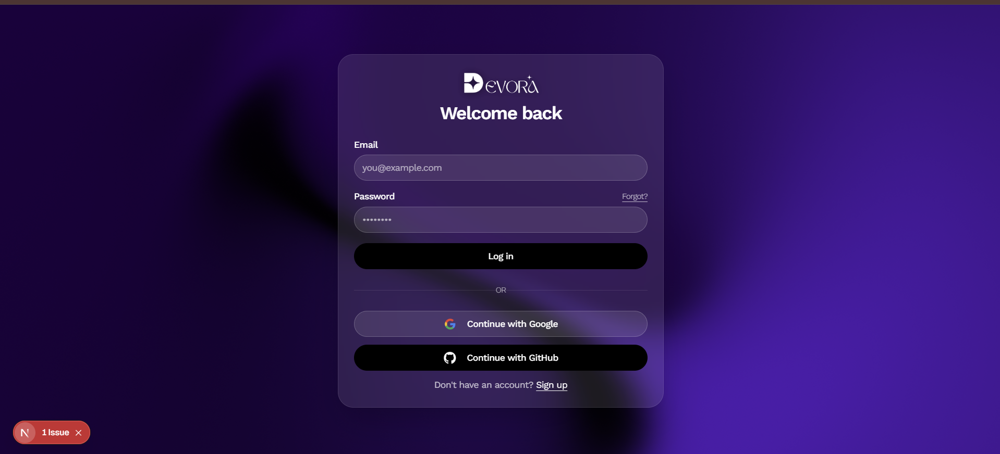
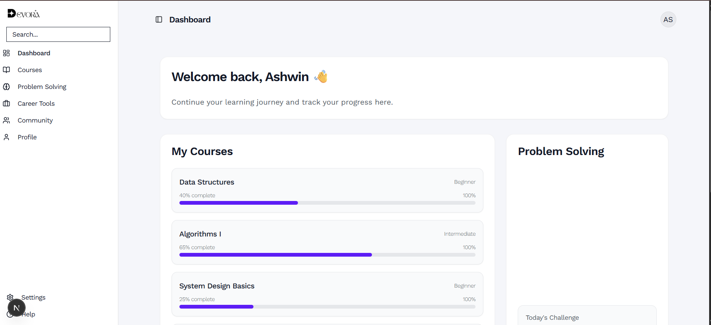

# Devora  

## 📖 Introduction  
**Devora** is a comprehensive Learning Management System (LMS) designed for students and instructors. It provides a modern, secure, and interactive platform for online learning, with built-in backend endpoints, strong authentication, and a scalable relational database backend.  

This project is currently **private**. Only approved members can contribute and raise PRs.  

---

## 📑 Table of Contents  
- [Features](#-features)  
- [System Architecture](#-system-architecture)  
- [UI Preview](#-ui-preview)  
- [Installation](#-installation)  
- [Usage](#-usage)  
- [Configuration](#-configuration)  
- [Dependencies](#-dependencies)  
- [Examples](#-examples)  
- [Troubleshooting](#-troubleshooting)  
- [Contributors](#-contributors)  
- [License](#-license)  

---

## ✨ Features  
- 📚 **Interactive Learning** – Engaging learning experiences for students and instructors.  
- ⚡ **Server-side Rendering** – Fast, SEO-friendly rendering for all pages.  
- 🎨 **Utility-first Styling** – Consistent and customizable UI styling.  
- 🧩 **Prebuilt UI Components** – Reusable and responsive components.  
- 🎬 **Smooth Animations** – Enhanced user experience with fluid transitions.  
- 🔐 **Secure User Authentication** – Protects user data and course content.  
- 🗄 **Relational Database Backend** – Reliable storage for course materials, users, and progress.  
- 🌐 **Built-in Backend Endpoints** – APIs for seamless integration and extensibility.  
- ✅ **Strongly Typed Components** – Safer and more maintainable development.  

---

## 📐 System Architecture  
  

---

## 🎨 UI Preview  
 
  
 
---

## ⚙️ Installation  
1. Clone the repository:
   
```bash
   git clone git@github.com:your-org/devora.git
   cd devora
````

2. Install dependencies:

   ```bash
   npm install
   ```

3. Set up your environment variables (see [Configuration](#-configuration)).

4. Run the development server:

   ```bash
   npm run dev
   ```

---

## 🚀 Usage

* Visit `http://localhost:3000` to access the LMS locally.
* Instructors can create courses and manage content.
* Students can enroll, track progress, and interact with materials.

---

## 🔧 Configuration

Create a `.env` file in the project root with:

```env
DATABASE_URL=your-database-url
JWT_SECRET=your-secret-key
NEXTAUTH_URL=http://localhost:3000
```

---

## 📦 Dependencies

* **Next.js** (server-side rendering)
* **TailwindCSS** (utility-first styling)
* **TypeScript** (strong typing)
* **Prisma / PostgreSQL** (relational database)
* **NextAuth.js** (authentication)

---

## 🖥 Examples

* Instructor dashboard for course creation.
* Student dashboard with progress tracking.
* Authentication flow with protected routes.

---

## 🛠 Troubleshooting

* **Database connection issues** → Verify `DATABASE_URL` in `.env`.
* **Auth errors** → Check JWT secret and NextAuth config.
* **Styling issues** → Run `npm run build` to rebuild Tailwind CSS.

---

## 👥 Contributors

* Only approved organization members can contribute.
* Please create a feature branch before raising a PR.

---

## 📜 License

This project is currently **private**. License terms will be provided upon public release.

```

